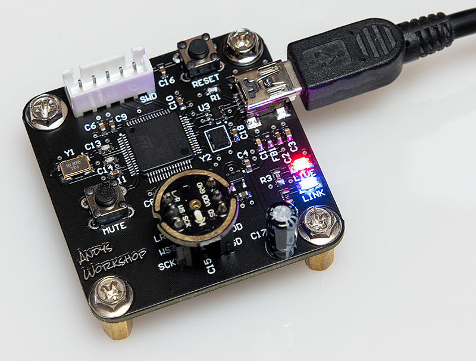

# I2S USB Microphone

This repository contains the source code to the firmware for a 48kHz 16-bit USB microphone implemented using an I2S INMP441 MEMS microphone and an STM32F446. 

Additional features include real-time graphic equalizer and smart volume control audio processing using ST Micro's GREQ and SVC libraries.

The documentation for this project can be found at [my website](https://andybrown.me.uk/2021/01/30/usb-microphone).



## Building the firmware

The firmware has been tested to build successfully on Ubuntu Linux and it should work on any similar system. You'll need to have the `arm-none-eabi` gcc toolchain installed. If you haven't got this then Google 'arm-none-eabi' for instructions how to install it.

If you also want to flash the firmware to a device over an SWD connection managed by ST-Link then you'll also need the `STM32CubeProgrammer` package. Again, if you haven't got it then Google it and follow the online installation instructions. When installing on a Linux system then do it from an elevated `sudo` prompt so that it gets installed into `/usr/local/STMicroelectronics/STM32Cube/STM32CubeProgrammer`.

A `Makefile` is provided that will build the firmware and optionally flash it. Here are example invocations:

```
make release     ; builds an optimised binary with -O3
make debug       ; builds a debug binary with -O0 -g3
```

If you also want to automatically flash the firmware using a connected ST-Link debugger then just append the `flash` target.

```
make release flash
make debug flash
```

The `flash` target assumes that you've installed `STM32CubeProgrammer` into `/usr/local/STMicroelectronics/STM32Cube/STM32CubeProgrammer`. If this is not the case then edit `Makefile` and correct the `PROGRAMMER` macro at the top of the file.

All generated files are placed in a `build` subdirectory.

## Developing the firmware

If you'd like to edit the firmware in the STM32Cube IDE then `.project` and `.cproject` files are provided that can be imported directly into the IDE. 

You will find `Debug` and `Debug_Semihosting` build configurations that use standard GDB debugging and debugging with semihosting enabled, respectively. There are matching `Debug` and `Debug_Semihosting` launch configurations to use for live hardware debugging. I don't keep semihosting enabled all the time because it's just so dreadfully slow.

The CubeMX GUI configuration file `usb-microphone.ioc` is provided for reference only. You can open and view it but don't try to generate project source code from it because the sources have diverged so much from what CubeMX expects that it will overwrite the firmware source.

## WAV samples

In the `wav-samples` directory you'll find some sample audio files:

`1-direct-no-transforms.wav`: Straight from the microphone, no processing. It's very quiet.

`2-svc-36db-amplification.wav`: 36dB amplification applied by the SVC filter.

`3-svc-greq.wav`: -6 -6 -6 +6 +6 +6 +6 +6 +6 +6 GREQ filter followed by +36dB SVC filter.
